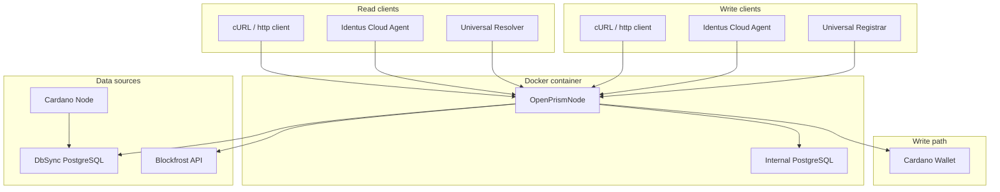

# Architecture

The diagram below shows how **OpenPrismNode (OPN)** sits between the Cardano ledger and the applications that read or
write PRISM DIDs.

---

## Syncing

| Mode                    | Setup                                                                                                                                              | Pros                                            | Cons                                                                                                                                                       |
|-------------------------|----------------------------------------------------------------------------------------------------------------------------------------------------|-------------------------------------------------|------------------------------------------------------------------------------------------------------------------------------------------------------------|
| **DbSync** (PostgreSQL) | Requires a local **Cardano Node** *and* **DbSync** service. Both are installed and maintained by the operator (outside of the OPN Docker Compose). | ‑ Full control over data and rollback handling. | - Requires non trivial server setup. - Needs more maintance and monitoring.  - Overall setup might breake more easily with Cardano Node / DbSync upgrades. | 
| **Blockfrost API**      | Sign up for a free API key and point OPN to the endpoint. No additional infrastructure.                                                            | ‑ Minimal setup time. - Zero maintenance.       | ‑ Third‑party dependency. ‑ Theoretical risk that edge‑case blocks are missing or delayed, or Rollback might behave unexpectably.                          |

### How OPN consumes blocks

* **Streaming loop** – OPN polls the chosen backend (PostgreSQL or Blockfrost API) and stores PRISM‑relevant
  transactions in its own database (also a PostgreSQL instance, which comes with the OPN Docker setup).
* **Switchable** – you can switch between both backends at any time. So you could start with DbSync, then switch to
  Blockfrost for a lighter setup, or vice versa. No resync needed.

---

## Endpoints Exposed by OPN

| Purpose                                     | Protocol | Typical Client                                    | Path or Port                |
|---------------------------------------------|----------|---------------------------------------------------|-----------------------------|
| **Resolve DIDs**                            | HTTP     | Curl, browsers, custom client, Universal Resolver | `/api/v1/identifiers/{did}` |
| **Resolve DIDs**                            | gRPC     | Identus Cloud agent                               | `:50053` (default)          |
| **Write DIDs** (create, update, deactivate) | HTTP     | Curl, custom client, Universal Registrar*         | `/api/v1/operations/*`      |
| **Write DIDs** (create, update, deactivate) | gRPC     | Identus Cloud agent                               | `:50053` (default)          |
| **Manage funding wallet**                   | HTTP     | Curl, browsers, custom client                     | `/api/v1/wallets/*`         |
| **Controlling Sync state**                  | HTTP     | Curl, browsers, custom client                     | `/api/v1/sync/*`            |

> **Tip:** If you are integrating **Identus Cloud Agent**, simply override the `PRISM_NODE_HOST`/`PORT` variables to
> point at your OPN instance instead of IOG’s reference node.

---

## Writing Transactions (DIDs)

To publish a DID operation, OPN needs access to a **Cardano wallet** via HTTP.
You can find the installation instructions for the wallet [here](https://github.com/cardano-foundation/cardano-wallet).
The wallet itself is not part of the OPN Docker image.

*If you only care about **resolving** DIDs, leave the wallet fields blank – OPN will run perfectly in read‑only mode.*

> A community
> issue ([https://github.com/bsandmann/OpenPrismNode/issues/123](https://github.com/bsandmann/OpenPrismNode/issues/123))
> tracks the possibility of using **Blockfrost API** for submitting transactions in the future. This would simplify the
> setup but not require a instance of the Cardano wallet.

---

## Putting It All Together

Running OPN typically follows these steps:

1. **Choose a backend** → local DbSync **or** Blockfrost API.
2. **Spin up OPN** via Docker (see Setup chapter).
3. **(Optional) Configure a wallet** if you plan to write DIDs (more elaborate setup needed).
4. **Integrate clients**:
    * Resolve only → curl, browser, custom client or Universal Resolver.
    * Use the Identus agent → Identus pointing at `grpc://your‑opn:50053`.

