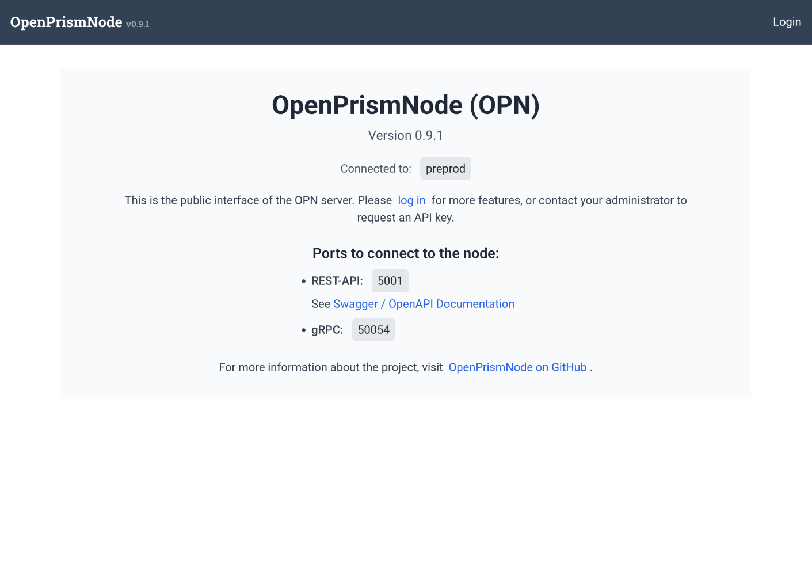
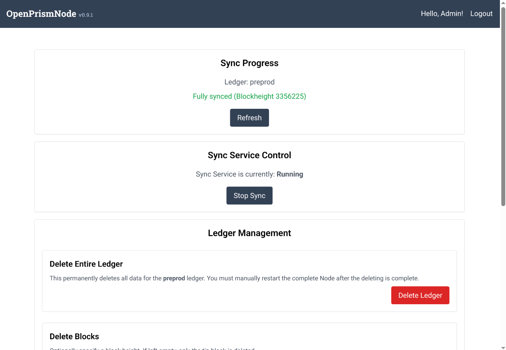

# Guide: Installing OPN Using the *Blockfrost* API for Syncing

By default, OPN (Open Prism Node) synchronizes data using *dbsync* as its backend database. However, if *dbsync* is not
available or not preferred, OPN can alternatively be synced using the [*Blockfrost* API](https://docs.blockfrost.io/).

> ⚠️ **Note:** This setup only applies to data synchronization. The creation and modification of DIDs still requires a
> Cardano Wallet and therefor a more elaborate setup. For instructions on how to set up the Cardano Wallet, refer to
> the [official documentation](https://github.com/cardano-foundation/cardano-wallet).

---

## Prerequisites

- SSH or terminal access to the server. The recommended environment is **Ubuntu 24.04 LTS**. Windows Subsystem for
  Linux (WSL) may also work but has not been tested.
- A Blockfrost API key, available for free at [blockfrost.io](https://blockfrost.io/).
  > Note: The free tier allows up to **50,000 requests per day**. The initial sync may take approximately 60 hours (~3
  days), but subsequent daily usage will remain well within this limit. If you choose to select a professional plan from Blockfrost, you can complete the initial sync of the OPN much faster

---

## Installation

1. Create a `docker-compose.yml` file and paste the following contents:

```yaml
version: '3.9'
services:
  openprismnode:
    image: ghcr.io/bsandmann/openprismnode:latest
    container_name: openprismnode
    restart: always
    depends_on:
      - prismdb
      - seq
    environment:
      - AppSettings__AdminAuthorizationKey=pwAdmin!
      - AppSettings__UserAuthorizationKey=pwUser!
      - AppSettings__PrismLedger__Name=preprod
      - AppSettings__PrismLedger__PrismPostgresConnectionString=Host=prismdb;Database=prismdatabase;Username=postgres;Password=postgres
      - AppSettings__CardanoWalletApiEndpoint=
      - AppSettings__CardanoWalletApiEndpointPort=
      - AppSettings__GrpcPort=50053
      - AppSettings__ApiHttpsPort=5001
      - AppSettings__SyncDataSource__Provider=Blockfrost
      - AppSettings__Blockfrost__BaseUrl=https://cardano-preprod.blockfrost.io/api/v0
      - AppSettings__Blockfrost__ApiKey=preprod123....
      - Seq__ServerUrl=http://seq:5341

    # Publish ports for external access if needed
    ports:
      - "5001:5001"
      - "50053:50053"
    networks:
      - prismnet

  prismdb:
    image: postgres:15
    container_name: prismdb
  restart: always
    environment:
      - POSTGRES_USER=postgres
      - POSTGRES_PASSWORD=postgres
      - POSTGRES_DB=prismdatabase
    expose:
      - "5432"
    volumes:
      - prismdb_data:/var/lib/postgresql/data
    networks:
      - prismnet

    seq:
      image: datalust/seq:latest
      container_name: seq
  restart: always
    environment:
      - ACCEPT_EULA=Y
    ports:
      - "5341:5341"
    volumes:
      - seq_data:/data
    networks:
      - prismnet

volumes:
  prismdb_data:
  seq_data:

networks:
  prismnet:
    driver: bridge
```

2. Replace the placeholder API key with your actual Blockfrost API key.

3. Update the admin and user passwords as needed.
   > 🔐 If the OPN instance is exposed to the internet, it is **strongly recommended** to change the admin password to
   prevent unauthorized access and potential data loss.

4. Navigate to the directory containing the `docker-compose.yml` file and start the services:

    ```bash
    docker compose up -d
    ```

---

## Syncing

The synchronization process starts automatically. To monitor progress:

- Open your browser and navigate to `http://localhost:5001` (or the appropriate IP address). This will open the OPN user
  interface.  You can see the connected network as well the different endpoints. Click on
  *Swagger / OpenAPI Documentation* to get the API endpoints for reference.
- Log in using the **admin password**
- From the admin interface, you can monitor and control the sync process via UI or API. 
  You can see the current sync state and the number of blocks that are already synced. You can stop and start the sync
  process and also rollback to a previous block or epoch.
- See troubleshooting section for potential issues.
---
