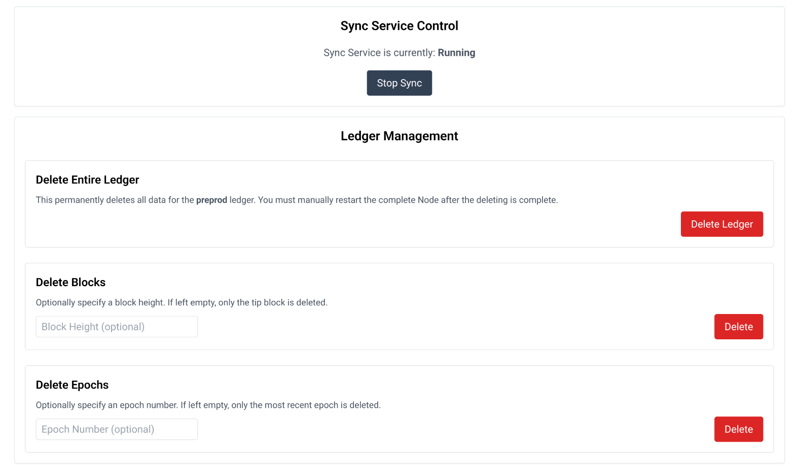

# Sync Process

If the datasource is setup correctly (either DbSync or Blockfrost API), the OPN will start syncing automatically and not monitoring or intervention is required.
Nonetheless it is possible to control the syncing process via the API or the Admin-UI. This is usually not required but useful for troubleshooting or a graceful shutdown of the OPN.

*Admin-UI*

The Admin-UI provides a simple interface to control the sync process. You can start and stop the sync process and also rollback to a previous block or epoch. The rollback will remove all blocks that are synced after the selected block or epoch. This is useful if you want to resync the node from a specific point in time.
While it is not required to stop the node first (by using the *Stop Sync* button), it is recommended to do so. 