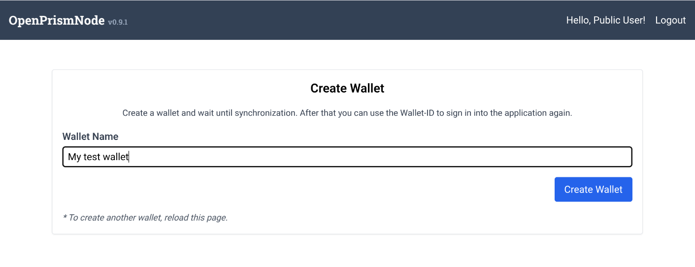
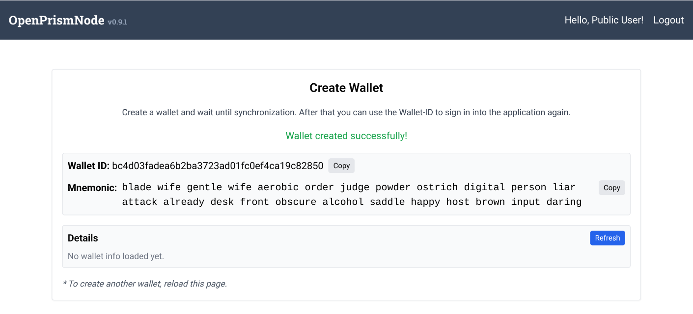
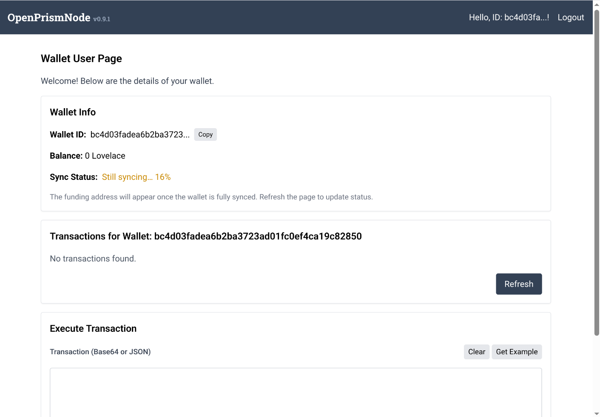
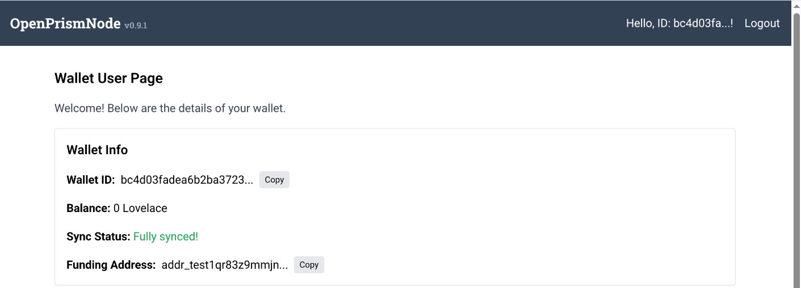

# Wallet Creation

To create a wallet:

1. Log in using the **user password**
   This password can be shared publicly to allow users to create their own wallets on the OPN.

2. After logging in, the user can immediately generate a new wallet. Syncing will begin automatically (note: this
   requires that the Cardano Wallet is running and the OPN is synced). 

3. The user should:
- Record the **mnemonic** and **wallet ID**
- Use the **wallet ID** for future logins instead of the shared user password
  

4. Once syncing completes, the wallet interface will show the **funding address** and **current balance**. State of a un-synced wallet:  State of a synced wallet: 

5. The wallet ID can now be used to:
- Create new DIDs
- Modify existing DIDs (update/deactivate)
  Simple use the walletId and use it as a request parameter in the API call against the Registrar API.
